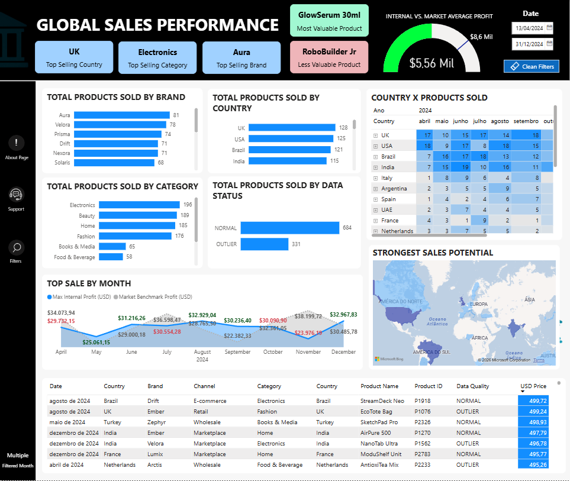
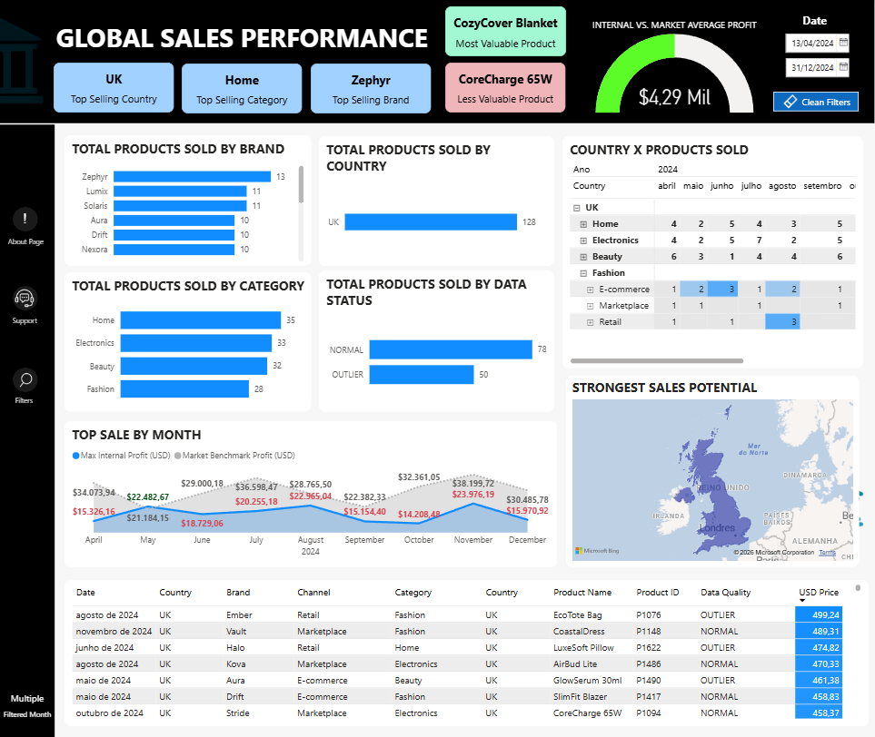
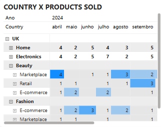
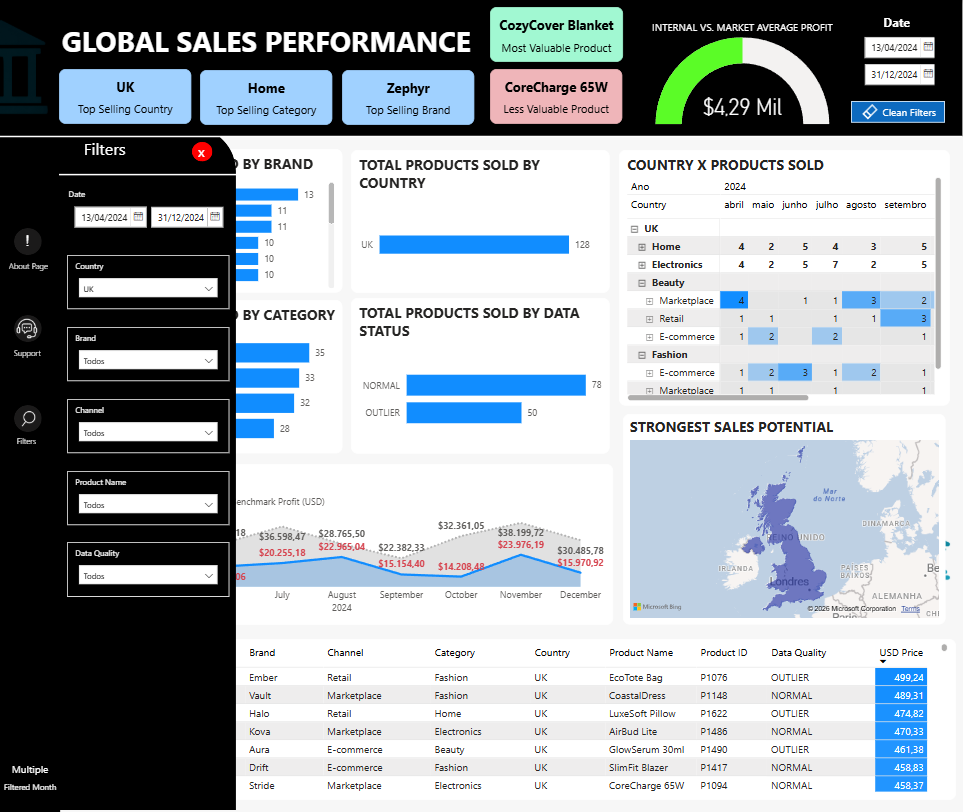

# 📊 Global Sales Performance

A Power BI dashboard for analyzing global sales data across countries, brands, categories, and sales channels. Built with focus on internal profit tracking, market benchmarking, and data quality monitoring.


---

## Overview



The main page consolidates the most relevant KPIs at a glance:

- **Top Selling Country** — UK leads with 134 products sold
- **Top Selling Category** — Electronics (203 units)
- **Top Selling Brand** — Aura (83 units)
- **Most Valuable Product** — GlowSerum 30ml
- **Less Valuable Product** — RoboBuilder Jr
- **Internal vs. Market Average Profit** — $7.66 Mil internal / $8.26 Mil market benchmark

---

## Visuals

### Products Sold by Brand, Country and Category

Bar charts showing distribution across the 7 top brands, 6 countries (UK, USA, Brazil, India, Italy, Argentina), and 6 product categories (Electronics, Beauty, Fashion, Home, Books & Media, Food & Beverage).

### Average Sale by Month

Line chart comparing **Max Internal Profit (USD)** vs **Market Benchmark Profit (USD)** from April to December 2024. Helps identify months where internal performance fell below market average.

### Sales Concentration by Product (Map)

Geographic heat map showing product concentration by region, built on Bing Maps.

### Monthly Sales Matrix

Pivot table breaking down units sold per country per month, enabling quick comparison across markets.



### Drill-down: Country → Channel → Product

The matrix supports drill-down from country level all the way to individual products per sales channel.



---

## Filters

The dashboard includes a filter panel accessible via the left sidebar:



| Filter | Options |
|---|---|
| Date | Date range picker |
| Country | Multi-select |
| Brand | Multi-select |
| Channel | E-commerce, Retail, Wholesale, Marketplace |
| Product Name | Multi-select |
| Data Quality | NORMAL / OUTLIER |

All visuals update dynamically when filters are applied.

---

## Data Quality

Sales records are flagged as **NORMAL** or **OUTLIER** — allowing analysis of clean vs. anomalous transactions side by side.

- Normal records: 720
- Outlier records: 346

---

## Project Structure

```
global-sales-performance/
├── README.md
└── images/
    ├── 01_overview.png
    ├── 02_uk_filtered.png
    ├── 03_drilldown.png
    └── 04_filters.png
```

> The `.pbix` file is not included in this repository. The dashboard source and data transformations are kept private.
